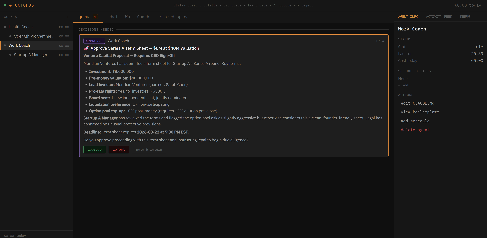

# Octopus

**Run your life like a company. You are the CEO.**

<a href="repo-tokens"></a>

Octopus is a personal operating system that lets one person run an organisation of AI agents. It's a fork of [NanoClaw](https://github.com/qwibitai/nanoclaw) extended with a company-style agent hierarchy, shared wiki, human-in-the-loop controls, and a local web dashboard.

Agents are organised in a tree — departments, managers, workers — with the user as CEO. Every agent runs in an isolated Linux container using the [Claude Agent SDK](https://github.com/anthropics/agent-sdk). All state lives in a single SQLite database. The entire system runs locally.



## How it works

- **Agent hierarchy** — free-form tree of agents, each in its own container with scoped filesystem and memory. Any structure: a personal life OS, a business, multiple ventures, or any hybrid.
- **Human-in-the-loop** — consequential decisions surface as approval cards. Cross-branch communications route through the CEO for review.
- **SharedSpace** — shared wiki layer (company intranet). Access governed by tree position: agents read up their ancestry chain and down their subtree.
- **Boardroom** — React dashboard for managing agents, approving decisions, chatting, editing wiki pages, and monitoring costs.
- **Branch isolation** — strict privacy between top-level branches by architecture, not policy. No information leaks between departments unless the CEO explicitly routes it.
- **Token budgets & circuit breakers** — per-agent cost controls with automatic shutdown on runaway spending.

## Architecture

```
CEO (human, HITL)
├── Work Coach
│   └── Startup A Manager
│       ├── Research Agent
│       └── Outreach Agent
├── Health Coach
│   └── Strength Programme Agent
└── Relationships Coach
```

Built as a monorepo with two packages:

| Package | Description |
|---------|-------------|
| [`packages/server`](packages/server) | NanoClaw fork — agent runner, REST + WebSocket API |
| [`packages/boardroom`](packages/boardroom) | React frontend — CEO control centre |

The server manages the agent tree, spawns containers, enforces budgets, serves the REST API (`/api/v1`), and pushes domain events over WebSocket (`/ws`). The boardroom connects to `localhost:3000` for real-time updates and CEO actions.

## Quick start

```bash
npm install                            # install all workspace deps
npm run build   -w @octopus/server     # compile server TypeScript
npm run start   -w @octopus/server     # start the server (port 3000)
npm run dev     -w @octopus/boardroom  # start the frontend dev server
```

The server must be running before the boardroom can connect.

## Built on

- [NanoClaw](https://github.com/qwibitai/nanoclaw) — lightweight agent runner
- [Claude Agent SDK](https://github.com/anthropics/agent-sdk) — agent execution harness
- TypeScript, Node.js (ESM), Vite + React, SQLite
